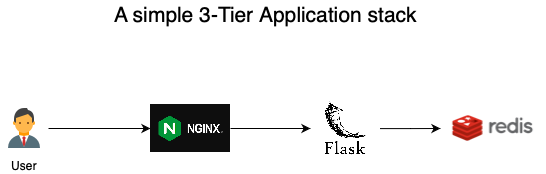

# test-3-tier-app



This is an example of a 3-tier application.
It consists of 3 components:
1) nginx
  - frontend server
  - uses nginx:alpine for smaller image size footprint
  - opens up host port 8080
  - has only 1 endpoint "/"
  - redirects calls to the app server at port 5000
2) python-flask
  - 2nd tier app server
  - uses python:2.7 image for smaller image size footprint
  - only installed required additional python packages to keep it lean 
  - listens to port 5000
  - has only 1 route / handler that returns Hi message, number of hits recorded and the hostname of the server
  - connects to backend redis server to update hits (write) and return current hits (read)
3) redis
  - 3rd tier / backend database (in-memory)
  - writes to /data (for persistence)
  - listens to port 5432
  - uses redis:alpine for smaller image size footprint


## dependencies
* docker


## How to setup and run this application stack:

run setup script:
```
  sh setup <build|deploy>
```
